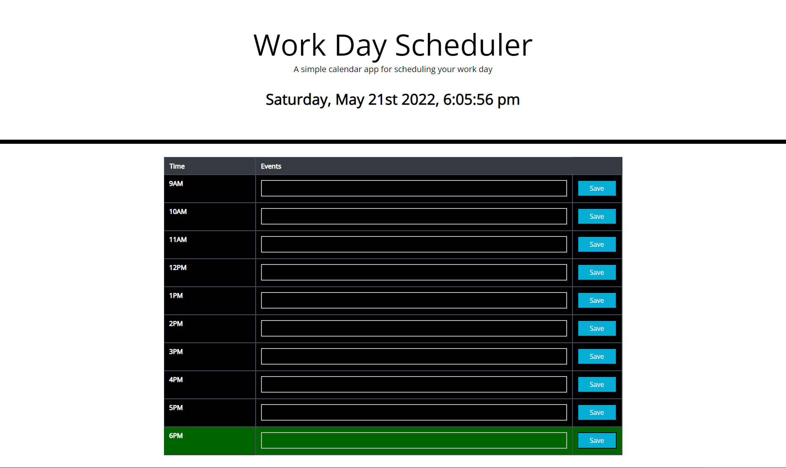

# This is the Module 5 Challenge assignment for the UofU Coding Bootcamp

## The goal of this assignment was to build upon starter code to create a functionable daily planner for hour to hour scheduling by utilizing HTML, CSS, JavaScript, jQuery, Moment.js, and Bootstrap.

Screenshot: 

>**Open Code Files:**
>
>HTML: [HTML](./index.html)
>
>CSS: [CSS](./style.css)
>
>Script: [Script](./script.js)

Live Site: https://jgriffith97.github.io/Daily-Planner/